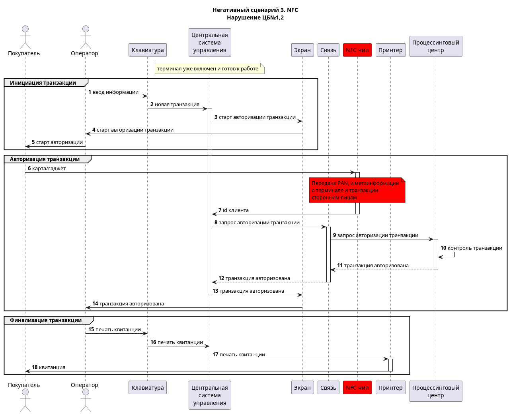

# POS-терминал

## Ценности
| Ценность                 | Негативное событие                                                                                                                     | Величина ущерба | Комментарий                           |
|--------------------------|----------------------------------------------------------------------------------------------------------------------------------------|-----------------|---------------------------------------|
| Персональные данные      | неавторизованный доступ (компрометация)                                                                                                | Высокий         | возможен оборотный штраф              |
| Деньги клиентов          | кража денег со счетов клиентов                                                                                                         | Высокий         | судебные иски                         |
| Информация о транзакциях | искажение информации о транзакциях, затрудняющее работу фискальных органов                                                             | Средний         | отзыв разрешения на эксплуатацию      |
| Информация о транзакциях | изменение информации о транзакциях, добавление в бумажную квитанцию политически ангажированного текста, призывов экстремистского плана | Средний         | репутационные издержки                |
| Товар                    | Оплата не прошла, но (дорогостоящий) товар выдан клиенту из-за неправильного статуса оплаты                                            | Средний         | финансовые потери из-за утраты товара |

## Цели безопасности
1. Выполняются только авторизованные транзакции 
2. Только авторизованные пользователи имеют доступ к конфиденциальной информации
3. Квитанция о транзакции содержит аутентичный результат выполнения

## Предположения безопасности
- аутентичная процессинговая система благонадёжна
- аутентичные операторы терминалов благонадёжны и обладают необходимой квалификацией
- не рассматриваются атаки связанные с внесением физических изменений в конструкцию терминала
- все операции с картами проводятся в онлайн режиме с онлайн-аутентификацией, не SDA, не по магнитной полосе и т.д.
- cardholder verification - проверка PIN в режиме онлайн

## Негативные сценарии 

### Негативный сценарий 1 - *Компрометация компонента Связь*
Нарушение ЦБ 1, 2, 3.

- Подмена статуса транзакции при передаче остальным компонентам 
- Передача ПД клиента из состава транзакции третьим лицам (PAN, сумма, id терминала, токены авторизации - частично)
- Подмена содержания транзакции при выполнении авторизации
- Подмена содержимого сообщений при выполнении клиринга или иного вида отчетности

### Негативный сценарий 2 - *Компрометация компонента Принтер*
Нарушение ЦБ 3. 
 
- Утрата товара по неоплате из-за чека с ложным статусом 
- Компрометирующее содержимое чека 

### Негативный сценарий 3 - *Компрометация компонентов NFC/card-reader*
Нарушение ЦБ 1, 2.

- Передача третьим лицам PAN + время операции 
- Подмена идентификаторов клиента

### Негативный сценарий 4 - *Компрометация компонента Клавиатура и Экран*
Нарушение ЦБ 1, 2.

- Передача пин-кода карты стороннему лицу
- Подмена суммы транзакции (при компрометации также компонента Экран позволяет списывать любые суммы)

### Негативный сценарий 5 - *Компрометация компонента *
Нарушение ЦБ 1, 2, 3.

### Негативный сценарий 6 - *Компрометация компонента *
Нарушение ЦБ 1, 2, 3.

### Негативный сценарий 7 - *Компрометация компонента *
Нарушение ЦБ 1, 2, 3.

