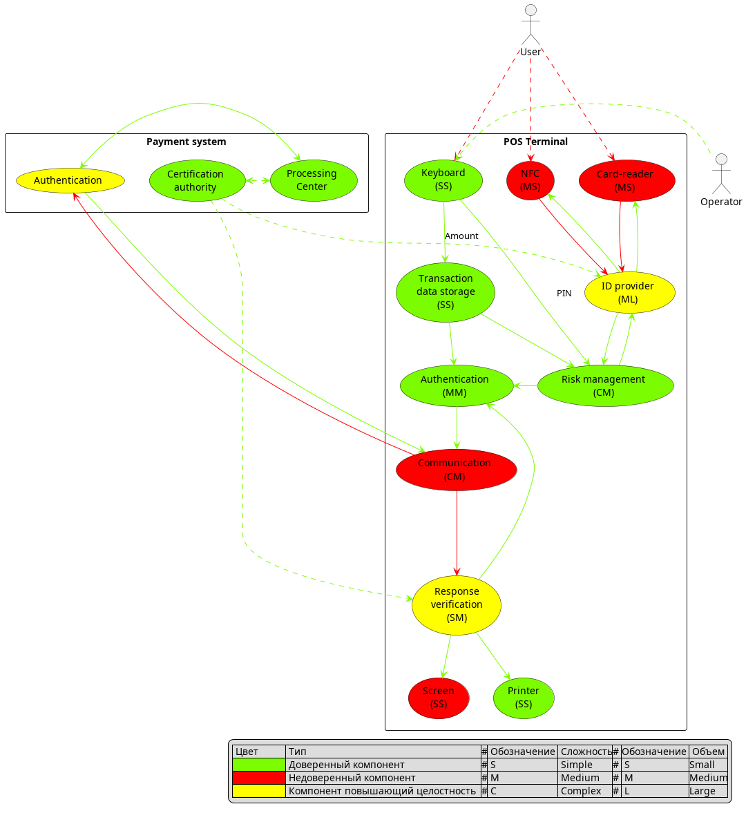

# POS-терминал

## Ценности
| Ценность                 | Негативное событие                                                                                                                     | Величина ущерба | Комментарий                           |
|--------------------------|----------------------------------------------------------------------------------------------------------------------------------------|-----------------|---------------------------------------|
| Персональные данные      | неавторизованный доступ (компрометация)                                                                                                | Высокий         | возможен оборотный штраф              |
| Деньги клиентов          | кража денег со счетов клиентов                                                                                                         | Высокий         | судебные иски                         |
| Информация о транзакциях | искажение информации о транзакциях, затрудняющее работу фискальных органов                                                             | Средний         | отзыв разрешения на эксплуатацию      |
| Информация о транзакциях | изменение информации о транзакциях, добавление в бумажную квитанцию политически ангажированного текста, призывов экстремистского плана | Средний         | репутационные издержки                |
| Товар                    | Оплата не прошла, но (дорогостоящий) товар выдан клиенту из-за неправильного статуса оплаты                                            | Средний         | финансовые потери из-за утраты товара |

## Цели безопасности
1. Выполняются только авторизованные транзакции 
2. Только авторизованные пользователи имеют доступ к конфиденциальной информации
3. Квитанция о транзакции содержит аутентичный результат выполнения

## Предположения безопасности
- аутентичная процессинговая система благонадёжна
- аутентичные операторы терминалов благонадёжны и обладают необходимой квалификацией
- не рассматриваются атаки связанные с внесением физических изменений в конструкцию терминала
- рассматриваются только операции по NFC и контактному чипу
- все операции с картами проводятся в онлайн режиме с онлайн-аутентификацией, не SDA, не по магнитной полосе и т.д.
- cardholder verification - проверка PIN в режиме онлайн

## Негативные сценарии 

### Негативный сценарий 1 - *Компрометация компонента Связь*
Нарушение ЦБ 1, 2, 3.

- Подмена статуса транзакции при передаче остальным компонентам 
- Передача ПД клиента из состава транзакции третьим лицам (PAN, сумма, id терминала, токены авторизации - частично)
- Подмена содержания транзакции при выполнении авторизации
- Подмена содержимого сообщений при выполнении клиринга или иного вида отчетности

Будем далее считать, что из метаданных транзакции можно извлечь соотношение PAN к дате и месту проведения транзакции, 
но не более с точки зрения ПД покупателя, поэтому для минимизации доверенных компонент примем, 
что эти данные не будут являться критическими ПД, утрата которых несет риски для ценностей стейкхолдеров.

### Негативный сценарий 2 - *Компрометация компонента Принтер*
Нарушение ЦБ 3. 
 
- Утрата товара по неоплате из-за чека с ложным статусом 
- Компрометирующее содержимое чека 

### Негативный сценарий 3 - *Компрометация компонентов NFC/card-reader*
Нарушение ЦБ 1, 2.

- Передача третьим лицам PAN + время операции 
- Подмена идентификаторов клиента

### Негативный сценарий 4 - *Компрометация компонента Клавиатура и Экран*
Нарушение ЦБ 1, 2.

- Передача пин-кода карты стороннему лицу
- Подмена суммы транзакции (при компрометации компонента Экран позволяет списывать любые суммы без ведома владельца карты)

## Архитектура решения и доверенные компоненты

|       Компонент       |         Статус         | Назначение                                                                                                        | Комментарий                                                                                                                                                    |
|:---------------------:|:----------------------:|-------------------------------------------------------------------------------------------------------------------|----------------------------------------------------------------------------------------------------------------------------------------------------------------|
|   Card-reader / NFC   |      Недоверенный      | Низкоуровневое взаимодействие с HSM                                                                               | Делаем минимально объемными - в основном как интерфейсы, стараемся пропускать по нему шифрованные данные                                                       |
|      ID provider      | Повышающий целостность | Реализация алгоритмов взаимодействия EVM, абстракция вида HSM, проверка подлинности данных HSM по сертификату УЦ  | Здесь основная цель - проверить, что карта реальная и принадлежит доверенному банку-эмитенту                                                                   |
|     Communication     |      Недоверенный      | Взаимодействие с ПС. Должен оперировать только сообщениями имеющими цифровую подпись из других компонентов        | Если обеспечить все стороны, использующие данный модуль, доступом к авторизации сообщений по цифровой подписи, то см. Н.С.1 для комментария                    |
| Response verification | Повышающий целостность | Проверка цифровой подписи УЦ платежной системы ответа ПС по статусу транзакции                                    | Максимально простой модуль который проверяет что пришедшие сообщения извне (от ПС) аутентичны, в таком случае можно сразу выдавать на принтер результат работы |
|       Keyboard        |       Доверенный       | Ввод суммы транзакции и PIN кода                                                                                  | Не может быть недоверенным, так как утечет пин или изменится исходный запрос до его попадания в любые другие блоки                                             |
|        Screen         |      Недоверенный      | Вывод информации и статуса транзакции                                                                             | Нет причин делать доверенным пока не внедряем QR-оплату                                                                                                        |
|        Printer        |       Доверенный       | Печать информации о статусе транзакции, принят основным источником доверенных данных о статусе                    | Обеспечиваем гарантированный вывод валидного статуса                                                                                                           |
|  Transaction Storage  |       Доверенный       | Сессионное хранилище внутренних данных транзакции в процессе ее совершения.                                       | Максимально простой компонент только для хранения достоверных данных, может сразу снабжать данные ЭЦП, также хранить историю транзакций                        |
|    Risk management    |       Доверенный       | Имплементация управления рисками со стороны терминала, проверка PIN, все взаимодействия с ПС через Authentication | Проверки связанные с оценкой рисков и проверкой владельца карты                                                                                                |
|    Authentication     |       Доверенный       | Исполнение процедуры авторизации с платежной системой                                                             | Формирование запроса на авторизацию транзакции                                                                                                                 |
